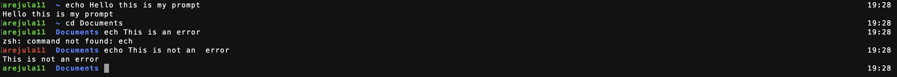

# My prompt configuration in bash and zsh

This repository contains my personalized prompt configuration for both Bash and Zsh shells. The prompt is designed to provide useful information while maintaining a clean and minimalistic appearance.

## Installation

### Bash

1. Copy the contents of `bash_prompt.sh` to your `~/.bashrc` or `~/.bash_profile` file.

2. Save the changes and restart your Bash shell or run `source ~/.bashrc` (or `source ~/.bash_profile`).

### Zsh

1. Copy the contents of `zsh_prompt.zsh` to your `~/.zshrc` file.

2. Save the changes and restart your Zsh shell or run `source ~/.zshrc`.

## Screenshots

## Configuration

Feel free to modify these files to customize the prompt according to your preferences.

